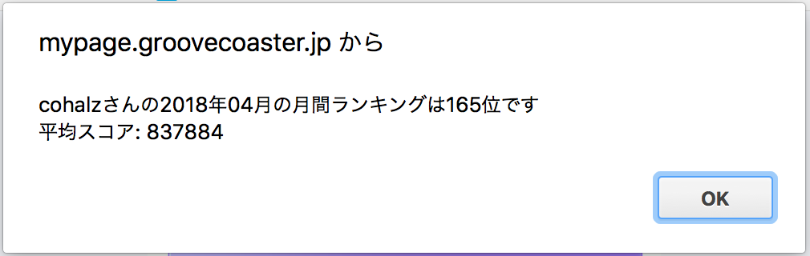

# Groove-Coaster-Tool
グルコス関連ツール置き場

## クレジット数確認ブックマークレット

```javascript
javascript:(function(){var xmlHttp=new XMLHttpRequest();xmlHttp.open("GET","https://mypage.groovecoaster.jp/sp/json/music_list.php",false);xmlHttp.send(null);var data=JSON.parse(xmlHttp.responseText);var play_count_data=data.music_list.map(function(e){return e.play_count;});var sum=play_count_data.reduce(function(a,b){return a+b;});alert("%E6%A5%BD%E6%9B%B2%E3%83%97%E3%83%AC%E3%82%A4%E7%B7%8F%E6%95%B0: "+sum+"\n"+Math.ceil(sum/3)+"%E3%82%AF%E3%83%AC%E3%81%8F%E3%82%89%E3%81%84%E3%81%97%E3%81%A6%E3%81%84%E3%81%BE%E3%81%99");})();
```

## 今月の月間ランキング確認

```javascript
javascript:(function(){var xmlHttp=new XMLHttpRequest();xmlHttp.open("GET","https://mypage.groovecoaster.jp/sp/json/player_data.php",false);xmlHttp.send(null);var player_data=JSON.parse(xmlHttp.responseText);var player_name=player_data.player_data.player_name;var index=0;var date=new Date();var now=date.getFullYear()+""+("0"+(date.getMonth()+1)).slice(-2);var flag=false;var firstScore=0;var myScore=0;while(!flag&&index<10){xmlHttp.open("GET","https://mypage.groovecoaster.jp/sp/json/monthly_ranking.php?id=0&page="+index,false);xmlHttp.send(null);if(xmlHttp.responseText[0]=='f'){alert(now.slice(0,4)+"%E5%B9%B4"+now.slice(4)+"%E6%9C%88%E3%81%AE%E6%9C%88%E9%96%93%E3%83%A9%E3%83%B3%E3%82%AD%E3%83%B3%E3%82%B0%E3%81%AF%E3%81%BE%E3%81%A0%E5%85%AC%E9%96%8B%E3%81%95%E3%82%8C%E3%81%A6%E3%81%84%E3%81%BE%E3%81%9B%E3%82%93")};var data=JSON.parse(xmlHttp.responseText);if(index==0){firstScore=data.rank[0].score;}for(var i=0;i<data.rank.length;i++){if(data.rank[i].player_name===player_name){myScore=data.rank[i].score;alert(player_name+"%E3%81%95%E3%82%93%E3%81%AE"+now.slice(0,4)+"%E5%B9%B4"+now.slice(4)+"%E6%9C%88%E3%81%AE%E6%9C%88%E9%96%93%E3%83%A9%E3%83%B3%E3%82%AD%E3%83%B3%E3%82%B0%E3%81%AF"+data.rank[i].rank+"%E4%BD%8D%E3%81%A7%E3%81%99\n"+"%E5%B9%B3%E5%9D%87%E3%82%B9%E3%82%B3%E3%82%A2: "+Math.floor(myScore/firstScore*1000000));flag=true;break;}}index++;};})();
```

## reload.gs
[GASを使ってグルーヴコースター設置店舗マップを半自動で取得・更新できる仕組みを作った](https://cohalz.hatenablog.com/entry/2018/04/02/195934) 参照
